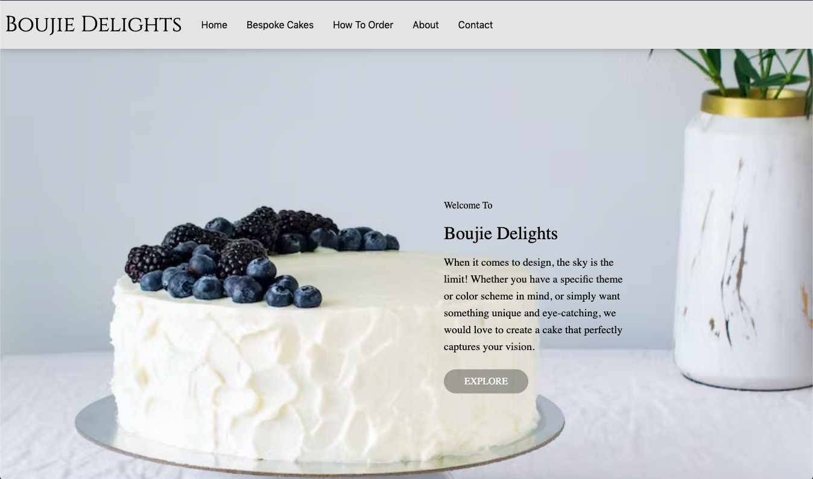

## About The Project
This repo is for a small business, who makes bespoke cakes. The website is built with React and styled with Tailwind CSS. The website offers a visually appealing and responsive user interface for browsing and contacting the business owner for inquiries.

<p align="right">(<a href="#readme-top">back to top</a>)</p>

### Features

- Visually appealing and responsive design.
- Browse the website to get to know more about the company.
- Contact form with Google ReCAPTCHA for secure form submissions.
- Integration with Google Sheets using Google Apps Script to store form data.

### Built With

- React: A JavaScript library for building user interfaces.
- Tailwind CSS: A utility-first CSS framework for rapid UI development.
- Google Apps Script: Used to send and store contact form data in Google Sheets.
- Google ReCAPTCHA: A security measure to prevent spam and abusive form submissions.

<p align="right">(<a href="#readme-top">back to top</a>)</p>

## Getting Started

1. Clone the repo
   ```sh
   git clone https://github.com/tlchambers/bespoke-cakes-website
   ```
2. Navigate to the project directory:
   ```sh
   cd bespoke-cakes-website
   ```
3. Install NPM packages
   ```sh
   npm install
   ```
4. Install NPM packages
   ```sh
   npm start
   ```

<p align="right">(<a href="#readme-top">back to top</a>)</p>

## Roadmap

- [x] Discuss client's requirements
- [x] Mindmap requirement and UI design
- [x] Develop components of website pages
- [x] Deploy website
- [x] Fix bugs

<p align="right">(<a href="#readme-top">back to top</a>)</p>

<!-- CONTRIBUTING -->

## Contributing

Contributions are what make the open source community such an amazing place to learn, inspire, and create. Any contributions you make are **greatly appreciated**.

If you have a suggestion that would make this better, please fork the repo and create a pull request. 

1. Fork the Project
2. Create your Feature Branch (`git checkout -b feature/AmazingFeature`)
3. Commit your Changes (`git commit -m 'Add some AmazingFeature'`)
4. Push to the Branch (`git push origin feature/AmazingFeature`)
5. Open a Pull Request

<p align="right">(<a href="#readme-top">back to top</a>)</p>
